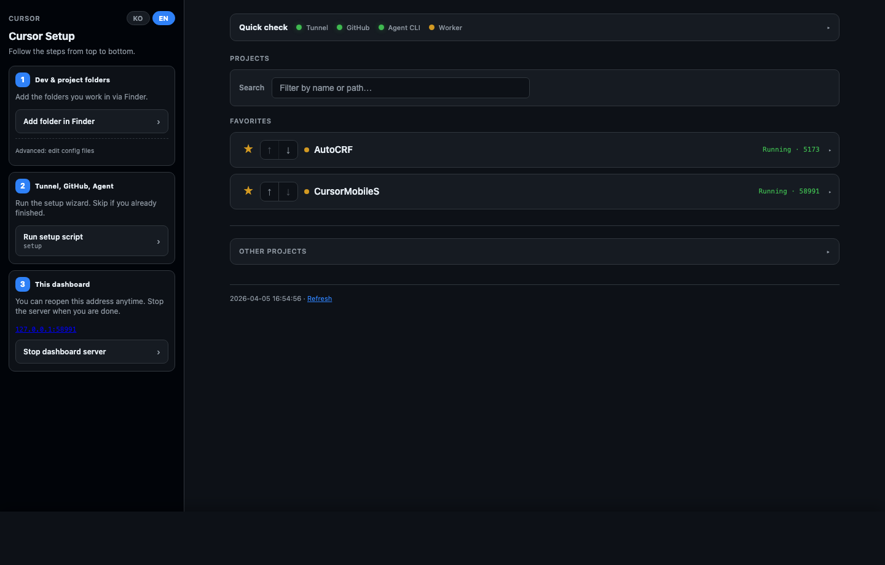
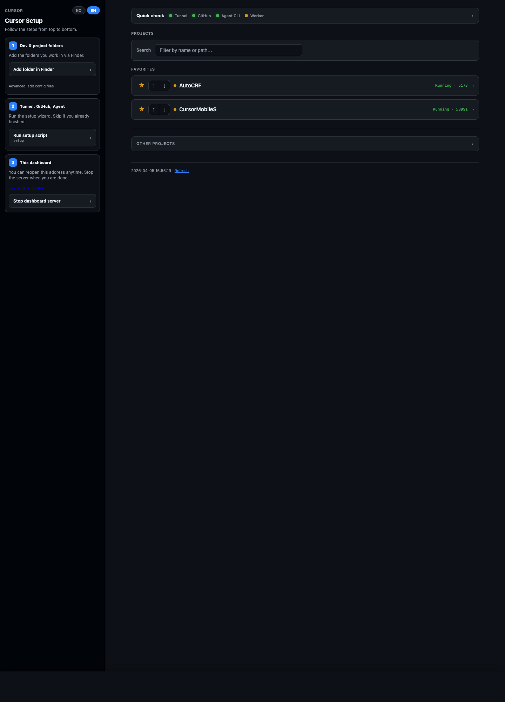
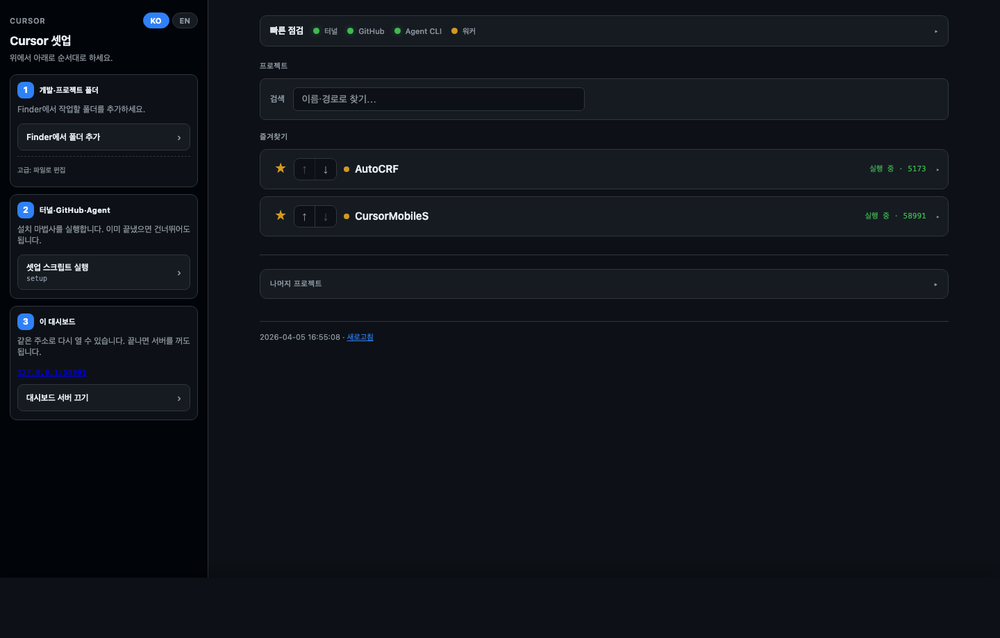
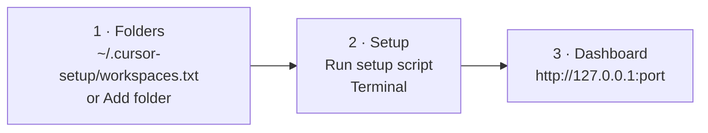
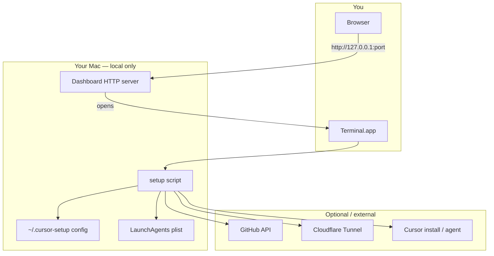
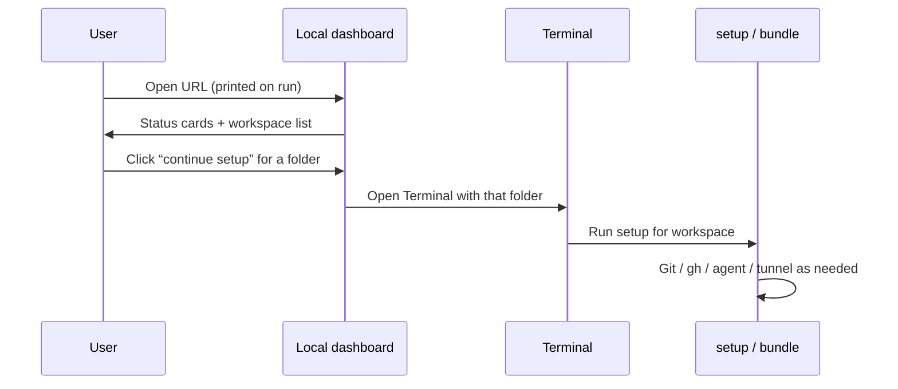

# CursorMobileS

**Opinionated macOS setup for [Cursor](https://cursor.com) Agent, GitHub, and optional [Cloudflare Tunnel](https://developers.cloudflare.com/cloudflare-one/connections/connect-networks/) — with a local browser dashboard so you can drive everything from one place.**

[](LICENSE)
[]()

Turn a Mac (Mac mini on the desk, or any Mac you SSH into) into a repeatable “dev box” profile: install prerequisites, wire GitHub (`gh`), install the Cursor Agent CLI, register a LaunchAgent worker, and optionally expose services through Cloudflare — without memorizing a long checklist.

---

## What it looks like (your browser, local only)

These screenshots are **real captures** of the local dashboard (Chrome headless → PNG). Only **`127.0.0.1`** appears in the UI — no public/WAN IP. Nothing is hosted on GitHub; after `./setup`, the page is served from **your Mac** (port may differ from the examples below).

**Regenerate the images** (requires Google Chrome on macOS):

```bash
./scripts/capture-readme-screenshots.sh --auto-start
```

Or run the same script while your dashboard is already up (`./setup` in another terminal); it will reuse `CURSOR_DASH_PORT`, then `58741`.

### English (default) — overview

Sidebar **Cursor Setup** (3 steps), quick-check pills, search, favorites / ports, refresh.



### English — taller viewport (more of the project list)

Same session, larger height so **Favorites** and **Other projects** are easier to see in the README.



### Korean UI

The dashboard supports **KO / EN** (toggle in the sidebar). Korean strings for the same layout:



### Run in this order (matches **Cursor Setup** in the sidebar)

| Step | What to do | Why |
|------|------------|-----|
| **1 — Dev & project folders** | Click **Add folder in Finder** (or edit `~/.cursor-setup/workspaces.txt` manually: one folder path per line). | The dashboard only lists folders it is allowed to see. Without entries, you will not see your projects here. `~/Dev/*` and Git roots under `~/Dev` are also scanned automatically — see [Workspace discovery](#workspace-discovery). |
| **2 — Tunnel, GitHub, Agent** | Click **Run setup script** (opens Terminal with this repo’s `setup`), or from any clone run `./setup --full-wizard` / pick a project and use **Continue setup** on a card. | This step installs or configures **Homebrew `gh`**, optional **Cloudflare Tunnel**, **Cursor Agent CLI**, and the **LaunchAgent worker** — only for what is still missing. |
| **3 — This dashboard** | Keep the tab open while you work; use **Stop dashboard server** in the sidebar when you are finished. | The small Python server is what renders this UI. The URL (e.g. `127.0.0.1:58741`) is shown in the sidebar and was printed in Terminal when you started `./setup`. |

**Shortest path to this screen:** clone the repo → `chmod +x setup && ./setup` → open the printed URL. Details: [Quick start](#quick-start).



### Reading the screenshots (same layout in EN / KO)

- **Top pills (e.g. “Tunnel · GitHub · Agent CLI · Worker”)** — One-glance **quick check** of the four big integrations. Green means the dashboard considers that piece in a good state; follow the main cards or sidebar if something needs action.
- **Search** — Filters the project list by **name or path** when you have many folders.
- **Favorites** — Pinned projects; **Running** and a **port** (e.g. `5173`) appear when `workspace-services.jsonl` (or the UI) knows your dev server port — see [Per-project dev commands & ports](#per-project-dev-commands--ports).
- **Other projects** — Additional discovered workspaces below favorites.
- **Refresh** — Regenerates status from disk and listening ports without restarting the server.

---

## Table of contents

- [What it looks like (your browser, local only)](#what-it-looks-like-your-browser-local-only)
- [Who this is for](#who-this-is-for)
- [Concept: how the pieces fit together](#concept-how-the-pieces-fit-together)
- [The local dashboard (what you see on screen)](#the-local-dashboard-what-you-see-on-screen)
- [Quick start](#quick-start)
- [Single-file bundle (double-click)](#single-file-bundle-double-click)
- [Workspace discovery](#workspace-discovery)
- [Per-project dev commands & ports](#per-project-dev-commands--ports)
- [Command-line usage](#command-line-usage)
- [Environment variables](#environment-variables)
- [Security & privacy](#security--privacy)
- [Requirements](#requirements)
- [License](#license)

---

## Who this is for

- You run **Cursor Agent** on a Mac and want **LaunchAgent** + logs in predictable locations.
- You use **GitHub** and want **`gh` auth**, remotes, and repo hygiene without repeating manual steps.
- You might use **Cloudflare Tunnel** to reach dev servers from another device.
- You like a **local web UI** (no cloud account for the dashboard itself) that lists projects and opens Terminal where the script continues only what is still missing.

---

## Concept: how the pieces fit together

The default entrypoint starts a **small Python HTTP server** on your Mac. Your browser talks to **localhost** only. When you click actions, **Terminal** runs the same `setup` script for a chosen folder; the script is idempotent-ish: it skips steps that already look done.



**Typical flow:**



---

## The local dashboard (what you see on screen)

The UI is intentionally **GitHub Desktop–inspired**: a sidebar, a main column of “cards”, and a scrollable list of **workspaces** (folders). Everything is generated as static HTML refreshed by the embedded server — no separate frontend build step.

### Global status cards (top area)

| Area | What it tells you |
|------|-------------------|
| **Cloudflare Tunnel** | Whether `~/.cloudflared` looks configured, tunnel process / LaunchAgent state, and a short summary of hostname → service when available. |
| **GitHub** | Whether `gh` is logged in (and your username when the CLI allows it). |
| **Cursor Agent** | Whether `~/.local/bin/agent` is installed. |
| **Cursor worker (global)** | LaunchAgent `com.cursor.agent.worker` — plist present, running or stopped, and which **working directory** it is bound to. |
| **cloudflared** | Background tunnel process or `com.cloudflared.tunnel` LaunchAgent. |

Status dots are a quick read: healthy / warning / not configured.

### Workspace rows (project list)

Each row is one discovered folder. You will usually see:

- **Folder name** and **full path** (monospace).
- **Git branch** and **`origin` remote** URL (or a hint if not a Git repo).
- A **one-line Git status** summary when applicable.
- **Worker line** — whether the global Cursor worker is aligned with *this* folder, running, stopped, or pointed elsewhere.

Actions (labels depend on locale) let you **open the folder in Finder**, **copy paths**, **open a local dev URL** when a port is known, and **continue setup in Terminal** for only the missing steps.

### Sidebar & settings

- **Search / filter** workspaces when the list grows.
- **Language**: Korean or English for dashboard strings (toggle + cookie). Default is **English**; set `CURSOR_DASH_LANG=ko` before launch for Korean-first.
- Optional **branding** via `CURSOR_DASH_BRAND`.
- **Repo rename** (GitHub): uses `gh repo rename` and expects `github.com` as `origin`.

---

## Quick start

1. **Clone** this repository on your Mac.

   ```bash
   git clone <your-fork-or-upstream-url>
   cd CursorMobileS
   ```

2. **Run** (default = local dashboard — the UI in the screenshot above):

   ```bash
   chmod +x setup
   ./setup
   ```

3. Open the URL printed in the terminal (usually `http://127.0.0.1:`*port*) — the same address appears under **Step 3** in the sidebar.

4. Follow the sidebar order: **folders → setup script → use the dashboard**. To configure one project, find it in the list and use **Continue setup** (or equivalent) so Terminal runs only what is still missing for that folder.

**Full terminal wizard** (no dashboard):

```bash
./setup --full-wizard
```

**Non-interactive defaults** are used unless you pass `--interactive`.

---

## Single-file bundle (double-click)

To ship one file (for example via GitHub Releases):

```bash
./scripts/build-bundle.sh
```

This writes **`dist/MacMini-Cursor-Setup.command`**. Double-click in Finder, or:

```bash
chmod +x dist/MacMini-Cursor-Setup.command
./dist/MacMini-Cursor-Setup.command
```

On first open of a downloaded script, use **Finder → right-click → Open** to satisfy Gatekeeper.

---

## Workspace discovery

Folders appear on the dashboard from:

1. **`~/.cursor-setup/workspaces.txt`** — one path per line (`#` comments allowed). See [`templates/workspaces.example.txt`](templates/workspaces.example.txt).
2. **`~/Dev/*`** — each immediate child directory.
3. **Git roots under `~/Dev`** — up to depth 8 (with ignores for `node_modules`, `vendor`, etc.).

Duplicate paths are deduplicated.

---

## Per-project dev commands & ports

Optional file: **`~/.cursor-setup/workspace-services.jsonl`** — one JSON object per line, keyed by workspace path. Lets the dashboard show **“open dev server”** style links when a port is known.

Example and field meanings: [`templates/workspace-services.jsonl.example`](templates/workspace-services.jsonl.example).

- **`exec`**: run a `.command` or script via `bash` (good for project-local starters).
- **`shell`**: a one-liner shell command (e.g. `npm run dev`).
- **`port`** (or `devPort`, `listen`, `listenPort`): port number for quick links.

The dashboard can also help **register** entries; they are merged into this JSONL file.

---

## Command-line usage

| Mode | Command |
|------|---------|
| Default | `./setup` — local dashboard |
| Full wizard | `./setup --full-wizard` |
| One workspace (no dashboard) | `./setup --workspace /path/to/project` |
| Cloudflare only | `./setup --tunnel-only` |
| GUI prompts (osascript) | `./setup --gui` |
| Terminal-only wizard | `./setup --cli` |
| With / without tunnel (preset) | `./setup --with-cloudflare` / `./setup --skip-cloudflare` |
| Print status | `./setup --status [folder]` |
| Dry run | `./setup --dry-run` |
| Help | `./setup --help` |

---

## Environment variables

| Variable | Purpose |
|----------|---------|
| `CURSOR_DASH_LANG` | `en` or `ko` — dashboard language (default **`en`**). |
| `CURSOR_DASH_HOST` | Bind address for the HTTP server (default **`0.0.0.0`**). Use **`127.0.0.1`** if the dashboard must not be reachable from the LAN. |
| `CURSOR_DASH_PORT` | Preferred port (default **`58741`** if free; otherwise an ephemeral port). |
| `CURSOR_DASH_BRAND` | Custom title string in the dashboard header. |
| `CURSOR_SETUP_DEFAULT_WORKSPACE` | Default folder for status and some flows. |
| `CURSOR_SETUP_FAST_PROMPTS` | `1` (default) skips many terminal prompts; `0` with `--interactive` asks more. |

---

## Security & privacy

- The dashboard server binds to **all interfaces** by default (`CURSOR_DASH_HOST` → `0.0.0.0`) so other devices on the **LAN** can open it if your firewall allows. Set **`CURSOR_DASH_HOST=127.0.0.1`** for localhost-only binding.
- **Secrets** (`cloudflared` credentials, env files) must stay out of git — see [`.gitignore`](.gitignore).
- Scripts may run **`curl | bash`** for the official Cursor install script when you opt in — review [Cursor’s install documentation](https://cursor.com) if you need to comply with corporate policy.
- **`gh`** and **Cloudflare** steps require you to authenticate with those providers; nothing in this repo replaces their OAuth or token flows.

---

## Requirements

- **macOS** (the entrypoint checks for Darwin).
- **Python 3** for the default dashboard server.
- **Git**; **Homebrew** recommended for `gh` and `cloudflared`.
- Network access when installing tools or talking to GitHub / Cloudflare / Cursor.

---

## License

This project is licensed under the [MIT License](LICENSE).

---

## Acknowledgements

Built for workflows around **Cursor**, **GitHub CLI**, and **Cloudflare Tunnel**. Product names belong to their respective owners.
