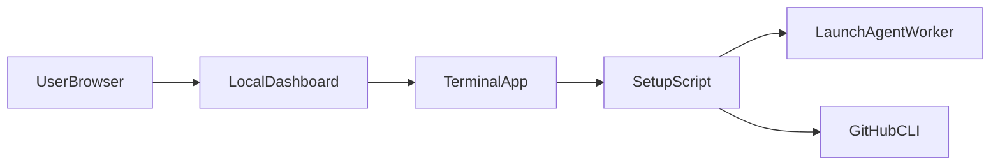

# Architecture Overview

This document summarizes the runtime flow and external interfaces.

## High-level flow

## Components

- `setup`: main entrypoint and mode router.
- `scripts/lib/dashboard_flow.sh`: local dashboard server and dashboard-triggered actions.
- `scripts/lib/cursor_agent.sh`: worker plist generation, registration, restart, migration.
- `scripts/lib/workspace_services.sh`: per-workspace command/port metadata.

## External interfaces

- GitHub CLI (`gh`) for auth and repository operations.
- macOS `launchctl` for persistent worker background services.
- Local HTTP dashboard on `127.0.0.1` by default (`CURSOR_DASH_LAN=1` for LAN exposure).

## Trust boundaries

- Local dashboard accepts actions from browser and executes terminal commands.
- Same-origin checks and allowlist checks protect POST actions.
- Credentials remain outside repository (`.env`, provider login state, etc.).

## Operational expectations

- Script flow is idempotent-ish: rerun should skip already configured steps.
- Bundle (`dist/MacMini-Cursor-Setup.command`) must be regenerated when source libs change.
